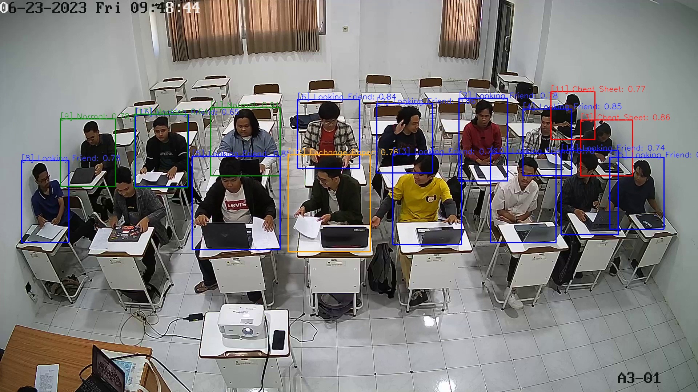

# Bye-Cheating

Integrated API system for cheating detection using CCTV, rtsp protocol and YOLOv7 Algorithm

## Preview

> Here is our demo

- [API Demo](https://youtu.be/b1nFwKaM9lg)
- [Demo](https://youtu.be/Jt4vekrCvrE)

## Prasyarat

### Hardware

| Component                  | Minimum                                             | Recommended\*                                   | Maximum   |
| -------------------------- | --------------------------------------------------- | ----------------------------------------------- | --------- |
| CPU socket                 | 1.3 GHz (64-bit processor) or faster for multi-core | 3.1 GHz (64-bit processor) or faster multi-core | 2 sockets |
| Memory (RAM)               | 8 GB                                                | - GB                                            | 64 GB     |
| Hard disks dan penyimpanan | 10 GB hard disk with a 60 GB system partition       | -                                               | No limit  |

### Packages

- `node 18` or latest
- `python 3.12`
- `ffmpeg`, could be downloaded at [official website](https://www.ffmpeg.org/download.html)
- `ultralytics`, more detail docs [official website](https://docs.ultralytics.com/models/yolov7/)
- `fastapi`, more detail docs [official website](https://fastapi.tiangolo.com/)
- `nginx`, more detail docs [official website](https://www.docker.com/)
- `redis`, more detail docs [official website](https://redis.io/)
- `docker & docker compose`, more detail docs [official website](https://www.docker.com/)
- `react.js`, more detail docs [official website](https://react.dev/)
- `vite`, more detail docs [official website](https://vitejs.dev/)

## Installation

1. Open a terminal and go inside the main root folder then run build.sh file
2. Or you can manually run each services with Dockerfile (Not recommended)
   - [gateway-service](./gateway/)
   - [general-service](./general/)
   - [watch-service](./watch/)
3. You can access localhost using the default port, running at 8080
   - localhost:8080/watch/\* => streaming endpoint
   - localhost:8080/\* => rest of endpoints
