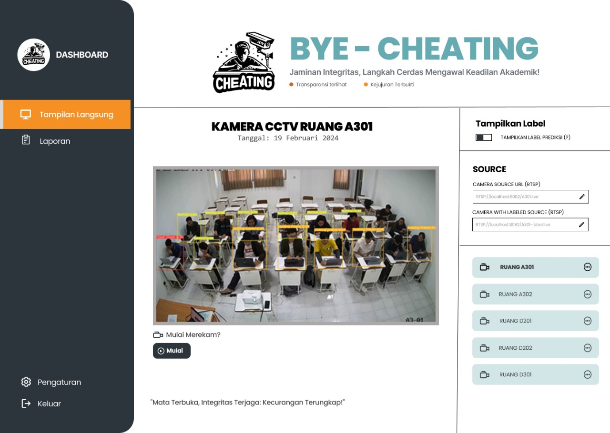

# Bye-Cheating

Sebuah aplikasi mendeteksi kecurangan ujian melalui sistem pendeteksis CCTV menggunakan Algoritma YOLOv7 Terintegrasi dengan website

## Preview

> Lihat demo aplikasi

- [Youtube](https://youtu.be/If0CceWZb44)
- [Website](https://by-cheating.web.app/)

## Prasyarat

- `node 18` atau terbaru
- `python 3.12`
- `ffmpeg`, dapat diunduh di [situs resmi](https://www.ffmpeg.org/download.html)
- `ultralytics`, lihat dokumentasi lengkap di [situs resmi](https://docs.ultralytics.com/models/yolov7/)
- `fastapi`, lihat dokumentasi lengkap di [situs resmi](https://fastapi.tiangolo.com/)
- `nginx`, lihat dokumentasi lengkap di [situs resmi](https://www.docker.com/)
- `redis`, lihat dokumentasi lengkap di [situs resmi](https://redis.io/)
- `docker & docker compose`, lihat dokumentasi lengkap di [situs resmi](https://www.docker.com/)
- `react.js`, lihat dokumentasi lengkap di [situs resmi](https://react.dev/)
- `vite`, lihat dokumentasi lengkap di [situs resmi](https://vitejs.dev/)

## Instalasi

1. Jalankan backend
   - dengan menggunakan terminal, masuk ke folder `backend/service`. di folder ini terdapat 2 buah file backend, yaitu:
     - model
     - report
   - lakukan instalasi menggunakan dokumentasi pada [folder backend](./backend/)
2. Jalankan frontend
   - menggunakan program console yang lain, masuk ke folder `frontend`
   - Jalankan perintah `npm i` untuk mengunduh dan mempersiapkan dependensi yang diperlukan
   - jalankan `npm run dev` di console, dan buka link frontend yang muncul pada console
