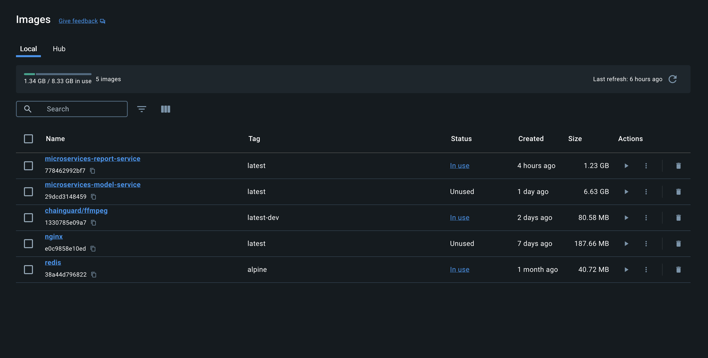

# Bye Cheating Backend

Pengembangan backend menggunakan microservices architecture dan dockerize.

## Arsitektur


## Instalasi

1.  Pastikan sudah menginstall docker. Jika belum bisa unduh melalui [situs docker](https://docs.docker.com/engine/install/)
2.  Buka terminal dan masuk ke dalam folder [backend](./)
3.  Jalankan perintah berikut pada terminal

    ```
    docker compose up -d
    ```

4.  Anda dapat menggunakan [Docker Desktop](https://www.docker.com/products/docker-desktop/) untuk memonitoring server yang sudah di **build** pada poin ke 3
5.  Kemudian server dapat diakses melalui [http://127.0.0.1:8080](http://127.0.0.1:8080)

## Instalasi Manual

Untuk melakukan langkah ini, ada beberapa hal yang Anda perlu ketahui:

- Server report pada [services/report](./services/report/) sebagai Restful API untuk koneksi ke website.
- Server machine_learning pada [services/model](./services/model/) sebagai Restful API untuk model.
- Hasil yang didapatkan berupa 2 server masing-masing sebagai container.



Berikut langkah untuk menginstall `service/report`:

1.  Buka terminal dan masuk ke dalam folder [utama](./) dimana terdapat file [compose.yml](./compose.yml)
2.  Jalankan perintah berikut pada terminal

    ```
    docker compose up --build report-service -d
    ```

    > gunakan -d jika Anda ingin server berjalan pada background. (Anda bisa melakukan monitoring melalui software docker)

3.  Anda dapat mengakses server dapat diakses melalui [http://127.0.0.1:8000](http://127.0.0.1:8000)

Berikut langkah untuk menginstall `service/model`:

1.  Buka terminal dan masuk ke dalam folder [utama](./) dimana terdapat file [compose.yml](./compose.yml)
2.  Jalankan perintah berikut pada terminal

    ```
    docker compose up --build model-service -d
    ```

3.  Anda dapat mengakses server dapat diakses melalui [http://127.0.0.1:8000](http://127.0.0.1:8000)
